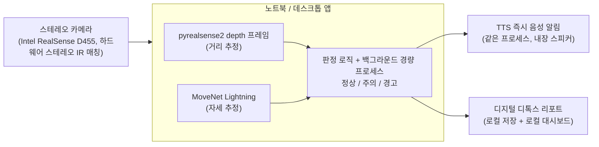

# 바른자세 (Bareunjase)

**듀얼캠 기반 책상 자세 · 디지털 디톡스 모니터링 앱** — 임베디드소프트웨어학과 캡스톤 프로젝트

> 인터랙티브 버전(구매 링크·다이어그램 포함): https://claude.ai/code/artifact/84a16571-282a-4f64-91c1-81442ed83ec3

---

## 1. 개요

스테레오 카메라 모듈(Intel RealSense D455) 한 대를 사용자의 노트북/데스크톱에 연결해, 하드웨어 스테레오 깊이 추정과 자세 추정을 결합함으로써 거북목·화면 근접·장시간 사용을 실시간으로 감지하고, 같은 프로세스 안에서 즉시 TTS 음성 알림을 재생하는 동시에 디지털 디톡스 리포트를 누적하는 경량 백그라운드 애플리케이션이다. 별도의 임베디드 보드 없이 사용자 PC 한 대에서 전부 처리되며, 게임 등 다른 작업과 동시에 실행돼도 성능에 영향이 없도록 리소스 사용을 최소화하는 것이 핵심 설계 목표다.

| 항목 | 내용 |
|---|---|
| 학과 | 임베디드소프트웨어학과 |
| 팀 구성 | 2인 |
| 학기 일정 | 15주 (구현 10주 + 논문 5주) |
| 발표 | 매주 20분 |
| 예산 | 스테레오 카메라 Intel RealSense D455 구매 (실 구매가는 팀 확인 후 4장 갱신 예정 — 4주차에 계획했던 oCamS-1CGN-U에서 변경됨, 아래 2장 참고) |

---

## 2. 진행 경과 (의사결정 로그)

프로젝트 방향이 여러 차례 조정되었다. 팀 회의·보고서 작성 시 참고할 수 있도록 변경 이력을 남긴다.

| 항목 | 초기안 | 최종안 | 변경 사유 |
|---|---|---|---|
| 주제 | 소음 기반 위험상황 감지 시스템 (사운드가드) | **책상 자세 · 디지털 디톡스 모니터링** (바른자세) | 팀 논의 후 최종 전환 |
| 예산 | 150,000원 → 200,000원 → 149,500원 → 46,080원 → 0원 | **289,300원** | 스테레오 카메라 모듈(oCamS-1CGN-U) 구매로 재증가 — 15만원 한도 대비 139,300원 초과, 초과분 조달 방안은 팀 내 확인 필요 |
| 컴퓨팅 장치 | 라즈베리파이4(2GB) → 라즈베리파이5(2GB) | **사용자 노트북/데스크톱 (별도 보드 없음)** | 교수님 피드백 — 굳이 별도 보드가 필요 없고, 데스크톱 앱으로 구현 가능 |
| 거리 감지 | VL53L0X(ToF) → HC-SR04P(초음파) | **듀얼 웹캠 스테레오 매칭 (거리 추정)** | 교수님 피드백 — 거리감까지 시각적으로 확인 가능한 카메라 기반 방식이 더 낫다는 제안 |
| 카메라 | USB 웹캠 신규 구매 → 기존 보유 카메라 1대 + 로지텍 C270 신규 1대 → 기존 보유 카메라 2대(동일 모델, 스테레오 페어) → 위드로봇 oCamS-1CGN-U(디바이스마트 289,300원, 계획 단계) | **Intel RealSense D455 (실제 구매·수령)** | 계획 단계에서는 oCamS-1CGN-U로 기록돼 있었으나, 실제로는 RealSense D455를 구매·수령함(4주차, 9/29). 구매 사유·정확한 가격은 팀 확인 후 반영 예정 — D455는 베이스라인 95mm 하드웨어 스테레오 깊이 카메라로, 출고 시 이미 스테레오 캘리브레이션이 완료되어 있어 `pyrealsense2` SDK로 바로 depth 프레임을 받을 수 있음(수동 체스보드 캘리브레이션 비중이 줄어듦, 6장 참고) |
| 알림 방식 | ESP32 GPIO 부저·LED(로컬) → 노트북 내장 스피커 TTS(원격, MQTT) | **노트북 내장 스피커 TTS (같은 프로세스 내, 로컬)** | 별도 기기가 없어져 네트워크 통신(MQTT) 자체가 불필요 |
| 3주차 내용 | (원래 계획) 스테레오 캘리브레이션·디스패리티 튜닝 착수 | **자세 추정 알고리즘 비교 연구조사로 전환** (RF·XGBoost·LightGBM·MLP 선행연구 교차비교), 캘리브레이션·튜닝은 4주차로 이동 | 듀얼캠 책상 자세 모니터링이 조별 프로젝트들의 공통 주제가 되면서, 차별화 전략을 자세 추정 알고리즘 자체로 가져가기로 결정 |
| 4주차 카메라 SDK | (계획) 위드로봇 SDK로 좌·우 프레임 캡처 후 자체 스테레오 매칭·캘리브레이션 | **Intel RealSense SDK 2.0(`pyrealsense2`)로 전환** | 실제 수령 카메라가 RealSense D455로 바뀌면서 SDK 자체가 교체됨. RealSense는 하드웨어 스테레오 IR 매칭 결과(depth frame)를 SDK가 직접 제공하므로, oCamS 대비 "직접 스테레오 매칭 알고리즘을 짜야 하는 부담"이 줄어드는 대신, 판정 로직에서 RealSense 좌표계·단위(미터)에 맞춰 거리 임계값을 다시 잡아야 함 |

---

## 3. 시스템 구성

- **입력** — 스테레오 카메라 모듈(Intel RealSense D455)을 USB-C 3.1 Gen 1로 노트북/데스크톱에 연결한다. 베이스라인 95mm로 고정된 적외선 스테레오 쌍 + RGB 센서가 한 장치에서 동기화 캡처되어 별도 물리 거치대 제작이나 소프트웨어 동기화가 필요 없다. IMU(Bosch BMI055) 내장.
- **거리 추정** — RealSense는 하드웨어 스테레오 IR 매칭을 온보드에서 수행해 `pyrealsense2` SDK로 바로 depth 프레임(미터 단위)을 받을 수 있다. 출고 시 스테레오 캘리브레이션이 완료된 상태라 체스보드 기반 수동 캘리브레이션은 필수가 아니며, 대신 물리 줄자로 실측 거리 대비 SDK가 보고하는 depth 값의 오차를 검증하는 절차로 대체한다(6장 4주차 참고).
- **자세 추정** — MoveNet Lightning으로 목·어깨 키포인트를 추출한다. 영상 프레임은 저장하지 않고 좌표·거리값만 실시간 처리 후 폐기한다.
- **판정 로직** — 자세 각도(정상/주의/경고 3단계)와 스테레오 기반 거리 임계값을 별도로 판정한 뒤 논리적으로 결합(OR)한다.
- **TTS 즉시 알림** — 판정 결과를 같은 프로세스 안에서 바로 내장 스피커로 재생한다. 별도 통신 과정이 없어 지연이 최소화된다.
- **디지털 디톡스 리포트** — 판정 이력과 화면 사용시간을 같은 기기에서 로컬로 일간·주간 단위로 누적한다.
- **경량 백그라운드 구동** — 샘플링 주기를 5초로 낮추고 프로세스 우선순위를 낮게 유지하며 CPU 전용 경량 모델을 사용해, 게임 등 다른 작업과 동시에 실행돼도 성능 저하가 없도록 한다.

### 블록도

영상 프레임은 저장하지 않고 좌표·거리값만 실시간 처리 후 폐기하며, 모든 처리가 한 기기 안에서 끝나 별도 서버나 클라우드로 전송되지 않는다.

---

## 4. 구매 리스트 (BOM)

> **갱신 필요**: 계획 단계(1~3주차)에는 위드로봇 oCamS-1CGN-U(디바이스마트 289,300원) 기준으로 아래 표를 작성했으나, 4주차(9/29)에 실제로는 **Intel RealSense D455**를 구매·수령했다. 정확한 구매 가격과 구매처는 팀 확인 후 이 표를 다시 갱신할 것 — 지금은 계획 당시 수치를 그대로 남겨두고 상단에 실제 변경 사실만 표시한다.

| 부품 | 사양 | 수량 | 예상가 | 소계 |
|---|---|---:|---:|---:|
| 스테레오 카메라 (Intel RealSense D455, 실 구매) | 하드웨어 스테레오 깊이 카메라, 베이스라인 95mm, IMU(BMI055) 내장, USB-C 3.1 Gen 1 | 1 | **확인 필요** | **확인 필요** |
| ~~스테레오 카메라 (oCamS-1CGN-U)~~ *(계획 단계, 실제로는 미구매)* | 위드로봇 USB 3.0 스테레오 카메라, 1MP 컬러 글로벌 셔터, 베이스라인 120mm 고정, IMU 내장 | — | 289,300원 | — |
| 노트북 / 데스크톱 | 기존 보유 장비 재사용 (별도 보드 없음) | 1 | 0원 | 0원 |
| **합계** | | | | **확인 필요** |

라즈베리파이5·전원 어댑터·microSD카드·HC-SR04P 초음파 센서는 교수님 피드백에 따라 별도 임베디드 보드 자체를 없애면서 구매 목록에서 제외했다. 카메라는 처음에 기존 보유 웹캠 2대로 DIY 스테레오 페어를 구성하려 했으나, 캘리브레이션·물리 마운트 제작 리스크와 두 대의 개별 USB 장치 간 동기화 문제를 줄이기 위해 하드웨어 스테레오 카메라 신규 구매로 방향을 정했고(계획 당시엔 oCamS-1CGN-U를 검토), 최종적으로 Intel RealSense D455를 구매했다. 최초 예산 15만원 한도 대비 초과 여부·초과분 조달 방안은 정확한 구매가 확인 후 다시 계산해야 한다.

---

## 5. AI 자세 학습 방법론

MoveNet은 사전학습된 모델을 그대로 사용하고(재학습 불필요), 팀이 직접 학습시키는 것은 그 위에 얹는 경량 자세 분류기다. 학습과 실제 구동 모두 노트북/데스크톱 한 대에서 이루어진다. 3주차 선행연구 교차비교 결과를 반영해 분류기 선정 절차를 아래와 같이 구체화했다(상세 근거는 `pose_algorithm_comparison_survey.md`, `papers_detailed_summary.md` 참고. 자세 클래스 정의·촬영 조건·라벨링 절차 등 실무 기준은 `data_collection_protocol.md`에 별도 정리).

1. **특징 추출** — MoveNet Lightning으로 전신 17개 keypoint를 추출하고, 스테레오 카메라의 깊이 정보를 결합한다. 엉덩이(hip) 중심으로 원점 이동, 어깨너비로 스케일 정규화한 뒤 목-어깨-엉덩이 각도 등 각도/거리 특징을 계산한다. (선행 WRF 논문은 얼굴·어깨 좌표만 사용 — 전신+깊이가 우리 프로젝트의 차별화 포인트)
2. **라벨링 기준** — RULA(Rapid Upper Limb Assessment) 인체공학 평가법의 각도 기준을 앵커로 삼아 정상/숙임/기대기/좌우 기울임 등 자세 구간을 정의하고, 팀원 간 교차 라벨링으로 기준 일관성을 확인한다.
3. **데이터 수집** — 공공데이터 중 책상 착석 자세에 맞는 것이 없어 직접 수집한다(선행연구도 WRF 20명·100장, XGBoost 논문 30명·1,550개 인스턴스 등 소규모 자체 수집 방식). 클래스별 균형 있게 최소 수백 장, 여러 날·조명·복장에서 분산 수집.
4. **증강** — 좌우 반전(자세는 좌우 대칭이므로 데이터 2배 효과), 키포인트 좌표 jitter.
5. **분류기 학습·선정** — Random Forest를 기준 모델로 삼아 Feature Selection·Weighting을 적용해 개선한다. 이후 동일한 데이터·특징으로 XGBoost·LightGBM(여유 시 경량 MLP)을 공정 비교해 최종 분류기를 결정한다 — "RF가 항상 최고"라고 예단하지 않고 실측으로 검증하는 것이 원칙이다.
6. **검증** — train/test 분리 + 교차검증, confusion matrix 분석, Accuracy·F1·ROC-AUC 비교에 더해 저사양 CPU 기준 추론시간·CPU/RAM 사용량까지 비교한다(백그라운드 상시 구동이 목표이므로 정확도만큼 자원 효율성도 중요).
7. **거리 판정 분리** — 스테레오 매칭 기반 거리 추정은 별도의 단순 임계값 규칙으로 판정 후 자세 판정과 논리적으로 결합(OR)한다.

**사전 검증 (4주차)** — 실제 자세 데이터가 모이기 전에, 위 5번 항목의 "RF → 변수 중요도 추출 → 가중치 적용 → WRF 재학습" 파이프라인 코드가 실제로 동작하는지 WRF 논문 공개 데이터셋(`Dataset.xlsx`, 얼굴·어깨 좌표 기반이라 우리 특징 공간과는 다름)으로 미리 돌려봤다 — 파이프라인 자체는 정상 동작 확인(변수 중요도 순서도 논문과 일치), 정확도 수치는 우리 프로젝트 성능 예상치로 쓸 수 없음. 상세: `experiments/wrf_paper_replication.py`, `experiments/wrf_paper_replication_results.md`.

---

## 6. 15주 일정

### 구현 (1~10주)

> **일정 변경 안내**: 3주차는 원래 계획(캘리브레이션·디스패리티 튜닝)이 아니라 자세 추정 알고리즘 비교 연구조사로 대체 진행했다(위 2절 결정 로그 참고). 그만큼 하드웨어 작업이 한 주 밀렸기 때문에, 4주차 이후 일정을 압축·재배치했다 — 원래 3주차 몫이던 캘리브레이션·게이트를 4주차로 이동하고, 데이터 수집을 5주차로 앞당기고, 7주차를 RF·XGBoost·LightGBM 공정 비교 실험에 전용해 10주차 완료 목표는 그대로 유지한다. 아래 표는 1~3주차는 완료 기준, 4주차부터는 개정 일정이다.

| 주차 | 내용 | 발표 포인트 |
|---|---|---|
| 1 | *(완료)* 주제 확정, 관련 연구 조사, 팀원 역할 분담(센싱 파이프라인 담당 · 애플리케이션 로직 담당) 확정, 스테레오 카메라(oCamS-1CGN-U) 구매·주문, 위드로봇 SDK/드라이버 설치 확인 | 주제 선정 배경, 목표, 관련 연구 요약, 역할 분담 |
| 2 | *(완료)* (센싱) 스테레오 카메라 SDK로 좌·우 프레임 동시 캡처 코드 구현(베이스라인 120mm 고정으로 별도 거치대 제작 불필요) · (로직) MoveNet 키포인트 추출 파이프라인 착수, 판정 로직 상태머신 설계(5초 샘플링·3회 연속 감지 기준) | 시스템 구성도, 구매 리스트, 개발 환경, 역할 분담 |
| 3 | *(완료 — 계획 변경)* 자세 추정 알고리즘 비교 연구조사(RF·XGBoost·LightGBM·MLP 선행연구 교차비교), 차별화 전략(전신 17키포인트+스테레오 깊이) 수립 | 알고리즘 비교 연구 결과 발표 (`barunjase_week3.pptx`) |
| 4 | **(원래 3주차 예정, 카메라 배송 대기로 추가 조정 + 카메라 기종 변경)** 카메라 도착 전(9/27~28)까지는 (로직) 전신 17키포인트+깊이 특징 추출 파이프라인 코드(`src/pose`, `src/features`), 데이터 수집 프로토콜(`data_collection_protocol.md`)을 카메라 없이 먼저 준비했다. 9/29 카메라 수령 — 계획했던 oCamS-1CGN-U가 아니라 **Intel RealSense D455**로 확인됨(2절 결정 로그 참고). RealSense는 출고 시 스테레오 캘리브레이션이 끝난 상태라 체스보드 기반 수동 캘리브레이션 대신 `pyrealsense2` SDK 설치·depth 스트림 확인 → 줄자 실측 대비 거리 오차 검증 순서로 진행한다. **4주차 게이트**(fps·프레임타임 스파이크·거리 정확도 1차 검증)는 이 검증까지 마쳐야 측정 가능하므로, 발표 시점까지 못 끝내면 소프트웨어 파이프라인 진행상황 위주로 발표하고 게이트 측정은 5주차로 이월 | RealSense SDK 연동 결과 + 거리 정확도 검증 결과 (또는 소프트웨어 파이프라인 진행상황, 검증 완료 시점에 따라) |
| 5 | RealSense depth 프리셋·필터(spatial/temporal filter) 튜닝 마무리·정확도 재검증, 판정 로직과 스테레오+포즈 파이프라인 1차 통합, **자체 데이터 수집 착수**(자세별 촬영 — 원래 6주차 몫을 앞당김) | 자세·거리 추정 데모, 데이터 수집 방법론 |
| 6 | 데이터 수집·라벨링 마무리, SQLite 저장 계층 구현, 판정 로직 정교화(RULA 기반 임계값 규칙), **RF 기준모델 학습(Feature Selection·Weighting 적용)** | 라벨링 기준, RF 기준모델 1차 성능 |
| 7 | **XGBoost·LightGBM(여유 시 경량 MLP)을 RF와 동일 데이터·특징으로 공정 비교**해 최종 분류기 선정, **PyInstaller 패키징 사전 점검**(핵심 의존성이 exe로 정상 빌드되는지 저사양 테스트 기기에서 미리 확인) | RF vs XGBoost vs LightGBM 실측 비교 결과 |
| 8 | 최종 분류기를 판정 로직에 통합, TTS 알림 연동, 백그라운드 경량화(TFLite 스레드 수 제한, 프로세스 우선순위 조정, 캡처 열고닫기 패턴 저사양 기기 실측) | 통합 시스템 1차 동작 데모(TTS 알림 포함) |
| 9 | 백그라운드 최적화 마무리, 일간·주간 리포트 집계 로직 + 이메일 전송 구현(우선), 여유 시 카카오톡 "나에게 보내기" 추가 | 백그라운드 구동 데모, 리포트·알림 데모 |
| 10 | 최종 통합, 종합 성능 평가, **(여유 시) 트레이 아이콘·설정창 포함 exe 패키징 완성** — 시간이 부족하면 스크립트 실행으로 시연 대체 | 최종 프로토타입 데모, 종합 성능 평가 |

### 논문 병행 작성 일정 (Multimedia Systems 드래프트 12/2 마감 대응)

**중요**: 원래 계획대로 "구현 10주(~11/8) 끝나고 11주차(11/15)부터 논문 시작"으로 가면 12월 2일(수) 드래프트 마감까지 약 2.5주밖에 남지 않는다 — 서론부터 결과까지 처음 쓰기엔 너무 촉박하다. 그래서 논문 집필을 11주차까지 미루지 않고 **4주차(지금)부터 구현과 병행**해서 진행한다. 서론·관련연구는 이미 3주차 조사 자료(`pose_algorithm_comparison_survey.md`, `papers_detailed_summary.md`)가 있어서 바로 초안을 쓸 수 있다는 게 유리한 점이다.

| 시기 | 구현 작업 | 논문 작업 (병행) |
|---|---|---|
| 4주차 (9/27~) | 카메라 도착 후 캘리브레이션+게이트, 특징 파이프라인 착수 | Introduction 초안 (문제의식·기여 요약) + Related Work 초안(3주차 조사자료 기반, 거의 바로 작성 가능) |
| 5주차 (10/4~) | 1차 통합, 데이터 수집 착수 | Related Work 완성, System Architecture(Methodology 1부: 시스템 구성) 초안 |
| 6주차 (10/11~) | 데이터 라벨링 마무리, RF 기준모델 학습 | Methodology 2부(특징 추출·RF 학습 방법) 작성 |
| 7주차 (10/18~) | XGBoost·LightGBM 공정 비교 실측 | Methodology 3부(실험 설계·평가지표) 작성, Results 섹션 틀 준비(표 양식만) |
| 8주차 (10/25~) | 최종 분류기 통합, TTS 연동 | **Results 섹션에 7주차 실측 수치 채움**, Discussion 초안 — 이게 논문의 병목이므로 7주차 실측을 최우선으로 |
| 9주차 (11/1~) | 백그라운드 최적화, 리포트 로직 | Discussion 보완, Abstract·Conclusion 초안 |
| 10주차 (11/8~) | 최종 통합, 종합 성능 평가 | 전체 초안 통합, 종합 성능평가 결과 Results에 반영 |
| 11~13주 (11/15~11/29) | 구현 마무리 여유분 처리 | 전체 드래프트 리비전, 팀원 간 교차검토, Multimedia Systems 저널 포맷·투고 규정 맞춤 |
| **12/2 (수)** | — | **드래프트 제출** |
| 14~15주 (12/6~) | — | 캡스톤 최종 발표 준비 (드래프트 제출 이후이므로 논문 내용 그대로 재구성) |

### 논문 (11~15주, 캡스톤 발표용 — 위 병행 일정과 함께 참고)

| 주차 | 내용 | 발표 포인트 |
|---|---|---|
| 11 | (병행 작성분 통합) 논문 구조 확정, 초안 리비전 착수 | 논문 개요, 관련연구·방법론 진행상황 |
| 12 | 리비전, 팀원 교차검토 | 결과 섹션 리뷰 |
| 13 | 최종 리비전, 저널 포맷팅 | 논문 전체 리허설 발표 |
| 14 | **드래프트 제출(12/2)**, 제출 후 정리 | 제출 완료 보고 |
| 15 | 최종 발표 | 최종 발표 |

---

## 7. 리스크 · 완화 전략

| 리스크 | 완화 전략 |
|---|---|
| 스테레오 캘리브레이션 오차 | 체스보드 패턴 기반 표준 캘리브레이션 절차 수립, 주기적 재보정 옵션 제공 |
| 백그라운드 리소스 경합 (게임 등 동시 구동) | 샘플링 주기 5초로 축소 + 낮은 프로세스 우선순위 + CPU 전용 경량 모델 유지로 프레임 드랍 최소화 |
| 자세 추정 정확도 이슈 | 카메라 위치·거리·스테레오 baseline 고정, 다양한 조건의 검증셋 구성 |
| 사생활 우려 | 영상 프레임 미저장, 랜드마크·거리 좌표만 실시간 처리 후 폐기 |
| 알림 피로 · 논문 스코프가 좁아 보일 수 있음 | 즉시 알림은 심한 근접에만, 자세 경고는 일정 시간 지속 시에만 발생하도록 유예시간 설계 + 화면 사용시간과 자세 악화 빈도의 상관관계 분석을 핵심 기여로 구성 |
| exe 패키징 시 의존성 문제 (OpenCV·TFLite 등) | 7주차에 저사양 테스트 기기에서 패키징 사전 점검을 미리 수행해 문제를 조기 발견, 트레이 아이콘·설정창 등 완성형 패키징은 10주차 스트레치로 분리 — 부족하면 스크립트 실행으로 시연 대체 |
| 3주차를 알고리즘 조사로 쓰면서 하드웨어 캘리브레이션 착수가 한 주 밀림 → 4주차에 캘리브레이션+특징 파이프라인 구축이 겹침 | 2인 팀의 역할 분담(센싱 담당·로직 담당)을 4주차에 한해 병렬로 최대한 활용 — 캘리브레이션과 특징 추출 파이프라인을 동시에 진행. 4주차 게이트 통과가 늦어지면 5주차 데이터 수집 착수 시점을 조정 |
| **(4주차 발견) depth 측정 사각지대와 감지 목적이 겹침** — D455 depth는 실측 기준 약 40cm 이하에서 무효값(스펙상 최소거리 0.6m)이 나오는데, 정작 "화면에 너무 가까워짐"을 감지하려는 시점이 이 근접 구간과 겹친다 | 이중화: depth가 유효한 구간(40cm~)은 그대로 거리값 사용, depth가 무효해지는 근접 구간은 RGB 화면 속 얼굴/어깨 면적 비율(WRF 논문의 "얼굴 면적비 A" 특징과 동일 아이디어)로 "더 가까워짐"만 판정 — 정확한 cm 없이도 이분류(정상/과도근접)는 가능. 5주차 필터 튜닝과 함께 구현·검증 예정 |

### 1주차 결정 사항

발표 전 미정이었던 3가지를 1주차 기준으로 확정한다. 실측 데이터가 쌓이면 3주차 성능 검증 결과에 맞춰 조정 가능한 작업 가정이다.

| 항목 | 결정 | 근거 |
|---|---|---|
| 3주차 성능 검증 통과 기준 | **최소 5fps 이상** (목표치 8~10fps) | 자세 모니터링은 초고속 반응이 필요한 태스크가 아니라 사람이 체감하는 지연 없이 판정하면 충분. 구동 환경이 라즈베리파이에서 노트북/데스크톱 CPU로 바뀌어 실측치는 이보다 높을 것으로 예상되며, 3주차에 재측정한다 |
| 스테레오 캘리브레이션 재보정 주기 | ~~체스보드 패턴 기반 초기 캘리브레이션을 1회 수행~~ → **(4주차 갱신) RealSense D455는 출고 시 스테레오 캘리브레이션이 끝나 있어 별도 재보정 불필요** — 대신 줄자 실측 대비 depth 정확도를 1회 검증하고, 카메라 위치를 바꾸지 않는 한 재검증하지 않는다 | 카메라 위치·거리·베이스라인을 고정하는 것을 전제로 하는 설계이므로, 물리적 위치가 바뀌지 않으면 재검증 없이도 정확도가 유지됨 |
| 센싱 샘플링 주기 | **1~2초 → 5초로 조정** | 저사양 노트북에서도 매끄러운 백그라운드 구동이 되도록 리소스 사용을 최소화. 다만 5초 해상도에서는 기존 "2초 지속" 판단이 불가능해져 근접 알림 기준을 함께 재정의 |
| TTS 알림 유예시간 | **화면 근접: 감지 즉시(1회) 알림, 이후 60초 쿨다운** · **자세 경고: 연속 3회 감지(5초 샘플링 기준 15초 지속) 시 알림, 이후 5분 쿨다운** | 5초 샘플링에서는 "2초 지속"을 감지할 해상도가 없어 근접 알림은 즉시 알림으로 단순화. 자세 경고는 기존 15초 지속 기준을 3회 연속 감지로 재정의해 그대로 유지, 반복 알림으로 인한 피로는 쿨다운으로 방지 |

---

## 8. 참고자료

- [TensorFlow Lite / MoveNet](https://www.tensorflow.org/lite/guide) — 온디바이스 포즈 추정 모델 (구동 환경은 데스크톱 CPU로 변경)
- [MediaPipe Pose Landmarker](https://developers.google.com/mediapipe/solutions/vision/pose_landmarker) — 대안 라이브러리
- [RULA (Rapid Upper Limb Assessment)](https://en.wikipedia.org/wiki/Rapid_Upper_Limb_Assessment) — 인체공학 자세 평가 방법론
- [PoseTrack (2025)](https://arxiv.org/html/2508.11683) — 라즈베리파이+MediaPipe 기반 착석 자세 모니터링 선행 연구
- [Stereo Camera Depth Estimation with OpenCV](https://learnopencv.com/depth-perception-using-stereo-camera-python-c/) — 스테레오 매칭·디스패리티 기반 거리 추정 (참고용, RealSense는 SDK가 매칭을 대신 처리)
- [pyttsx3](https://pypi.org/project/pyttsx3/) — 오프라인 로컬 TTS 파이썬 라이브러리
- [Intel RealSense D455 공식 스펙](https://www.intelrealsense.com/depth-camera-d455/) — 베이스라인 95mm, IMU(BMI055) 내장, depth 이상적 범위 0.6~6m (4주차 카메라 변경 후 채택)
- [pyrealsense2 (Python 래퍼) — PyPI](https://pypi.org/project/pyrealsense2/) — RealSense SDK 2.0 파이썬 바인딩, depth 프레임 획득에 사용
