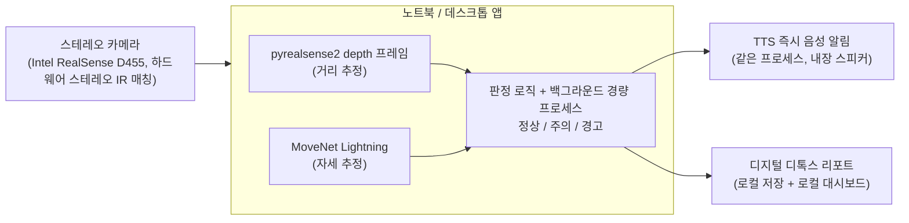

# 바른자세 (Bareunjase)

**듀얼캠 기반 책상 자세 · 디지털 디톡스 모니터링 앱** — 임베디드소프트웨어학과 캡스톤 프로젝트

> 인터랙티브 버전(구매 링크·다이어그램 포함): https://claude.ai/code/artifact/84a16571-282a-4f64-91c1-81442ed83ec3

---

## 1. 개요

스테레오 카메라 모듈(Intel RealSense D455) 한 대를 사용자의 노트북/데스크톱에 연결해, 하드웨어 스테레오 깊이 추정과 자세 추정을 결합함으로써 거북목·화면 근접·장시간 사용을 실시간으로 감지하고, 같은 프로세스 안에서 즉시 TTS 음성 알림을 재생하는 동시에 디지털 디톡스 리포트를 누적하는 경량 백그라운드 애플리케이션이다. 별도의 임베디드 보드 없이 사용자 PC 한 대에서 전부 처리되며, 게임 등 다른 작업과 동시에 실행돼도 성능에 영향이 없도록 리소스 사용을 최소화하는 것이 핵심 설계 목표다.

| 항목 | 내용 |
|---|---|
| 학과 | 임베디드소프트웨어학과 |
| 팀 구성 | 2인 |
| 계획 범위 | 구현 13주(1~13주차) — 논문은 4주차부터 구현과 계속 병행 작성, 12/2 드래프트 제출까지 |
| 발표 | 매주 20분 |

---

## 2. 진행 경과 (의사결정 로그)

프로젝트 방향이 여러 차례 조정되었다. 팀 회의·보고서 작성 시 참고할 수 있도록 변경 이력을 남긴다.

| 항목 | 초기안 | 최종안 | 변경 사유 |
|---|---|---|---|
| 주제 | 소음 기반 위험상황 감지 시스템 (사운드가드) | **책상 자세 · 디지털 디톡스 모니터링** (바른자세) | 팀 논의 후 최종 전환 |
| 컴퓨팅 장치 | 라즈베리파이4(2GB) → 라즈베리파이5(2GB) | **사용자 노트북/데스크톱 (별도 보드 없음)** | 교수님 피드백 — 굳이 별도 보드가 필요 없고, 데스크톱 앱으로 구현 가능 |
| 거리 감지 | VL53L0X(ToF) → HC-SR04P(초음파) | **듀얼 웹캠 스테레오 매칭 (거리 추정)** | 교수님 피드백 — 거리감까지 시각적으로 확인 가능한 카메라 기반 방식이 더 낫다는 제안 |
| 카메라 | USB 웹캠 신규 구매 → 기존 보유 카메라 1대 + 로지텍 C270 신규 1대 → 기존 보유 카메라 2대(동일 모델, 스테레오 페어) → 위드로봇 oCamS-1CGN-U(디바이스마트, 계획 단계) | **Intel RealSense D455 (기존 보유 장비 사용)** | 계획 단계에서는 oCamS-1CGN-U 신규 구매로 기록돼 있었으나, 실제로는 기존에 보유하고 있던 RealSense D455를 그대로 사용하기로 함(4주차, 9/29). D455는 베이스라인 95mm 하드웨어 스테레오 깊이 카메라로, 출고 시 이미 스테레오 캘리브레이션이 완료되어 있어 `pyrealsense2` SDK로 바로 depth 프레임을 받을 수 있음(수동 체스보드 캘리브레이션 비중이 줄어듦, 5장 참고) |
| 알림 방식 | ESP32 GPIO 부저·LED(로컬) → 노트북 내장 스피커 TTS(원격, MQTT) | **노트북 내장 스피커 TTS (같은 프로세스 내, 로컬)** | 별도 기기가 없어져 네트워크 통신(MQTT) 자체가 불필요 |
| 3주차 내용 | (원래 계획) 스테레오 캘리브레이션·디스패리티 튜닝 착수 | **자세 추정 알고리즘 비교 연구조사로 전환** (RF·XGBoost·LightGBM·MLP 선행연구 교차비교), 캘리브레이션·튜닝은 4주차로 이동 | 듀얼캠 책상 자세 모니터링이 조별 프로젝트들의 공통 주제가 되면서, 차별화 전략을 자세 추정 알고리즘 자체로 가져가기로 결정 |
| 4주차 카메라 SDK | (계획) 위드로봇 SDK로 좌·우 프레임 캡처 후 자체 스테레오 매칭·캘리브레이션 | **Intel RealSense SDK 2.0(`pyrealsense2`)로 전환** | 실제 수령 카메라가 RealSense D455로 바뀌면서 SDK 자체가 교체됨. RealSense는 하드웨어 스테레오 IR 매칭 결과(depth frame)를 SDK가 직접 제공하므로, oCamS 대비 "직접 스테레오 매칭 알고리즘을 짜야 하는 부담"이 줄어드는 대신, 판정 로직에서 RealSense 좌표계·단위(미터)에 맞춰 거리 임계값을 다시 잡아야 함 |

---

## 3. 시스템 구성

- **입력** — 스테레오 카메라 모듈(Intel RealSense D455)을 USB-C 3.1 Gen 1로 노트북/데스크톱에 연결한다. 베이스라인 95mm로 고정된 적외선 스테레오 쌍 + RGB 센서가 한 장치에서 동기화 캡처되어 별도 물리 거치대 제작이나 소프트웨어 동기화가 필요 없다. IMU(Bosch BMI055) 내장.
- **거리 추정** — RealSense는 하드웨어 스테레오 IR 매칭을 온보드에서 수행해 `pyrealsense2` SDK로 바로 depth 프레임(미터 단위)을 받을 수 있다. 출고 시 스테레오 캘리브레이션이 완료된 상태라 체스보드 기반 수동 캘리브레이션은 필수가 아니며, 대신 물리 줄자로 실측 거리 대비 SDK가 보고하는 depth 값의 오차를 검증하는 절차로 대체한다(5장 4주차 참고).
- **자세 추정** — MoveNet Lightning으로 목·어깨 키포인트를 추출한다. 영상 프레임은 저장하지 않고 좌표·거리값만 실시간 처리 후 폐기한다.
- **판정 로직** — 자세 각도(정상/주의/경고 3단계)와 스테레오 기반 거리 임계값을 별도로 판정한 뒤 논리적으로 결합(OR)한다.
- **TTS 즉시 알림** — 판정 결과를 같은 프로세스 안에서 바로 내장 스피커로 재생한다. 별도 통신 과정이 없어 지연이 최소화된다.
- **디지털 디톡스 리포트** — 판정 이력과 화면 사용시간을 같은 기기에서 로컬로 일간·주간 단위로 누적한다.
- **경량 백그라운드 구동** — 샘플링 주기를 5초로 낮추고 프로세스 우선순위를 낮게 유지하며 CPU 전용 경량 모델을 사용해, 게임 등 다른 작업과 동시에 실행돼도 성능 저하가 없도록 한다.

### 블록도

영상 프레임은 저장하지 않고 좌표·거리값만 실시간 처리 후 폐기하며, 모든 처리가 한 기기 안에서 끝나 별도 서버나 클라우드로 전송되지 않는다.

---

## 4. AI 자세 학습 방법론

MoveNet은 사전학습된 모델을 그대로 사용하고(재학습 불필요), 팀이 직접 학습시키는 것은 그 위에 얹는 경량 자세 분류기다. 학습과 실제 구동 모두 노트북/데스크톱 한 대에서 이루어진다. 3주차 선행연구 교차비교 결과를 반영해 분류기 선정 절차를 아래와 같이 구체화했다(상세 근거는 `pose_algorithm_comparison_survey.md`, `papers_detailed_summary.md` 참고. 자세 클래스 정의·촬영 조건·라벨링 절차 등 실무 기준은 `data_collection_protocol.md`에 별도 정리).

1. **특징 추출** — MoveNet Lightning으로 전신 17개 keypoint를 추출하고, 스테레오 카메라의 깊이 정보를 결합한다. 엉덩이(hip) 중심으로 원점 이동, 어깨너비로 스케일 정규화한 뒤 목-어깨-엉덩이 각도 등 각도/거리 특징을 계산한다. (선행 WRF 논문은 얼굴·어깨 좌표만 사용 — 전신+깊이가 우리 프로젝트의 차별화 포인트)
2. **라벨링 기준** — RULA(Rapid Upper Limb Assessment) 인체공학 평가법의 각도 기준을 앵커로 삼아 정상/숙임/기대기/좌우 기울임 등 자세 구간을 정의하고, 팀원 간 교차 라벨링으로 기준 일관성을 확인한다.
3. **데이터 수집** — 공공데이터 중 책상 착석 자세에 맞는 것이 없어 직접 수집한다(선행연구도 WRF 20명·100장, XGBoost 논문 30명·1,550개 인스턴스 등 소규모 자체 수집 방식). 클래스별 균형 있게 최소 수백 장, 여러 날·조명·복장에서 분산 수집.
4. **증강** — 좌우 반전(자세는 좌우 대칭이므로 데이터 2배 효과), 키포인트 좌표 jitter.
5. **분류기 학습·선정** — Random Forest를 기준 모델로 삼아 Feature Selection·Weighting을 적용해 개선한다. 이후 동일한 데이터·특징으로 XGBoost·LightGBM(여유 시 경량 MLP)을 공정 비교해 최종 분류기를 결정한다 — "RF가 항상 최고"라고 예단하지 않고 실측으로 검증하는 것이 원칙이다.
6. **검증** — train/test 분리 + 교차검증, confusion matrix 분석, Accuracy·F1·ROC-AUC 비교에 더해 저사양 CPU 기준 추론시간·CPU/RAM 사용량까지 비교한다(백그라운드 상시 구동이 목표이므로 정확도만큼 자원 효율성도 중요).
7. **거리 판정 분리** — 스테레오 매칭 기반 거리 추정은 별도의 단순 임계값 규칙으로 판정 후 자세 판정과 논리적으로 결합(OR)한다.

**사전 검증 (4주차)** — 실제 자세 데이터가 모이기 전에, 위 5번 항목의 "RF → 변수 중요도 추출 → 가중치 적용 → WRF 재학습" 파이프라인 코드가 실제로 동작하는지 WRF 논문 공개 데이터셋(`Dataset.xlsx`, 얼굴·어깨 좌표 기반이라 우리 특징 공간과는 다름)으로 미리 돌려봤다 — 파이프라인 자체는 정상 동작 확인(변수 중요도 순서도 논문과 일치), 정확도 수치는 우리 프로젝트 성능 예상치로 쓸 수 없음. 상세: `experiments/wrf_paper_replication.py`, `experiments/wrf_paper_replication_results.md`.

별도로, 우리 프로젝트 자체 특징 스키마(`src/features/posture_features.py`) 기준의 RF 학습 스켈레톤도 `src/logic/rf_baseline.py`에 작성해뒀다 — 합성(가짜) keypoint로 4번 항목의 증강(좌우반전+jitter)부터 5번의 RF 학습·평가까지 파이프라인이 동작하는지 확인한 것으로, 이것 역시 정확도 수치 자체는 의미 없다(합성 데이터라 클래스가 인위적으로 구분되게 만들어져 있음). 5주차 실제 데이터 수집 후 데이터 로딩 부분만 실제 데이터로 교체해 재사용 예정.

---

## 5. 일정 (12/2 논문 드래프트 제출까지)

### 구현 (1~13주)

> **일정 변경 안내**: 3주차는 원래 계획(캘리브레이션·디스패리티 튜닝)이 아니라 자세 추정 알고리즘 비교 연구조사로 대체 진행했다(위 2절 결정 로그 참고). 그만큼 하드웨어 작업이 한 주 밀렸기 때문에, 4주차 이후 일정을 압축·재배치했다 — 원래 3주차 몫이던 캘리브레이션·게이트를 4주차로 이동하고, 데이터 수집을 5주차로 앞당기고, 7주차를 RF·XGBoost·LightGBM 공정 비교 실험에 전용해 10주차 완료 목표는 그대로 유지한다. 아래 표는 1~3주차는 완료 기준, 4주차부터는 개정 일정이다.
>
> **(4주차 재조정)** 논문은 11주차부터 따로 몰아쓰는 게 아니라 4주차부터 구현과 계속 병행 작성해왔으므로, 원래 11~13주차에 잡아뒀던 "논문 전용 리비전" 기간을 따로 두지 않고 구현 심화·보강 기간으로 돌렸다. 별도 발표 일정(14~15주차)은 이 문서에서 제외하고, 계획은 논문 드래프트 제출 마감인 12/2(13주차)까지만 잡는다.

| 주차 | 내용 | 발표 포인트 |
|---|---|---|
| 1 | *(완료)* 주제 확정, 관련 연구 조사, 팀원 역할 분담(센싱 파이프라인 담당 · 애플리케이션 로직 담당) 확정, 스테레오 카메라(oCamS-1CGN-U) 구매·주문, 위드로봇 SDK/드라이버 설치 확인 | 주제 선정 배경, 목표, 관련 연구 요약, 역할 분담 |
| 2 | *(완료)* (센싱) 스테레오 카메라 SDK로 좌·우 프레임 동시 캡처 코드 구현(베이스라인 120mm 고정으로 별도 거치대 제작 불필요) · (로직) MoveNet 키포인트 추출 파이프라인 착수, 판정 로직 상태머신 설계(5초 샘플링·3회 연속 감지 기준) | 시스템 구성도, 구매 리스트, 개발 환경, 역할 분담 |
| 3 | *(완료 — 계획 변경)* 자세 추정 알고리즘 비교 연구조사(RF·XGBoost·LightGBM·MLP 선행연구 교차비교), 차별화 전략(전신 17키포인트+스테레오 깊이) 수립 | 알고리즘 비교 연구 결과 발표 (`barunjase_week3.pptx`) |
| 4 | **(원래 3주차 예정, 카메라 배송 대기로 추가 조정 + 카메라 기종 변경)** 카메라 도착 전(9/27~28)까지는 (로직) 전신 17키포인트+깊이 특징 추출 파이프라인 코드(`src/pose`, `src/features`), 데이터 수집 프로토콜(`data_collection_protocol.md`)을 카메라 없이 먼저 준비했다. 9/29 카메라 수령 — 계획했던 oCamS-1CGN-U가 아니라 **Intel RealSense D455**로 확인됨(2절 결정 로그 참고). 수령 당일 USB 인식이 2.1(USB2 속도)로 잡혀 "No Frames Received" 오류가 발생 → USB-C 포트 재연결로 3.2 정상 인식되며 해결(원인은 케이블/포트 접촉 불량으로 추정, 재발 시 케이블 교체로 대응). **4주차 게이트 완료**: `src/capture/realsense_capture.py`로 fps·프레임타임 스파이크 측정 결과 **평균 29.43fps, 평균 프레임간격 33.4ms, 최대 프레임간격 34.2ms, 스파이크(67ms 초과) 0회** — 목표치(5fps 최소, 8~10fps 목표) 대폭 상회. 거리 정확도는 실측 기준 **약 40cm 이상부터 안정적으로 측정**됨을 확인(정밀 오차값은 5주차 재검증 결과 참고). 이 과정에서 "40cm 미만 근접 시 depth 무효값 발생"이 "화면에 너무 가까워짐" 감지 목적과 겹치는 리스크를 발견해 6장에 기록, RGB 얼굴면적비 기반 보완안 수립 | RealSense SDK 연동 결과 + fps/스파이크 게이트 결과 + 거리 정확도 1차 검증 결과 + USB 트러블슈팅 경험 |
| 5 | RealSense depth 프리셋·필터(spatial/temporal filter) 튜닝 마무리·정확도 재검증(카메라 수평·정렬 고정 후 줄자 실측, 6장 참고), 판정 로직과 스테레오+포즈 파이프라인 1차 통합, **자체 데이터 수집 착수**(자세별 촬영 — 원래 6주차 몫을 앞당김) **(10/1~10/6 진행: 참가자 2명 235장 수집·라벨 반영, 다인 환경 대응(자동 사용자 인식), 판정 로직 1차 통합, 라벨링 교차검증 도구 완료 — 아래 "5주차 구현 진행 현황" 참고. 근접 사각지대 보완 구현 완료(실측 검증 대기), depth 필터 튜닝 실측 완료 — 기본 프리셋 SDK기본+구멍메우기 확정)** | 자세·거리 추정 데모, 데이터 수집 방법론 |
| 6 | 데이터 수집·라벨링 마무리, SQLite 저장 계층 구현, 판정 로직 정교화(RULA 기반 임계값 규칙), **RF 기준모델 학습(Feature Selection·Weighting 적용)** | 라벨링 기준, RF 기준모델 1차 성능 |
| 7 | **XGBoost·LightGBM(여유 시 경량 MLP)을 RF와 동일 데이터·특징으로 공정 비교**해 최종 분류기 선정, **PyInstaller 패키징 사전 점검**(핵심 의존성이 exe로 정상 빌드되는지 저사양 테스트 기기에서 미리 확인) | RF vs XGBoost vs LightGBM 실측 비교 결과 |
| 8 | 최종 분류기를 판정 로직에 통합, TTS 알림 연동, 백그라운드 경량화(TFLite 스레드 수 제한, 프로세스 우선순위 조정, 캡처 열고닫기 패턴 저사양 기기 실측) | 통합 시스템 1차 동작 데모(TTS 알림 포함) |
| 9 | 백그라운드 최적화 마무리, 일간·주간 리포트 집계 로직 + 이메일 전송 구현(우선), 여유 시 카카오톡 "나에게 보내기" 추가 | 백그라운드 구동 데모, 리포트·알림 데모 |
| 10 | 최종 통합, 종합 성능 평가, **(여유 시) 트레이 아이콘·설정창 포함 exe 패키징 완성** — 시간이 부족하면 스크립트 실행으로 시연 대체 | 최종 프로토타입 데모, 종합 성능 평가 |
| 11 | 구현 심화·보강 — 10주차까지 완료한 항목 중 미흡했던 부분 보완, 추가 검증 (논문은 계속 병행 작성 — 아래 표 참고) | 보강 결과 |
| 12 | 구현 심화·보강 계속, 종합 테스트 | 종합 테스트 결과 |
| 13 | 최종 구현 마무리, 논문 Results·Discussion에 반영할 최종 수치 확정 | 최종 성능 평가, 논문 반영 수치 |

### 논문 병행 작성 일정 (Multimedia Systems 드래프트 12/2 마감 대응)

**중요**: 원래 계획대로 "구현 10주(~11/8) 끝나고 11주차(11/15)부터 논문 시작"으로 가면 12월 2일(수) 드래프트 마감까지 약 2.5주밖에 남지 않는다 — 서론부터 결과까지 처음 쓰기엔 너무 촉박하다. 그래서 논문 집필을 11주차까지 미루지 않고 **4주차(지금)부터 구현과 병행**해서 진행한다. 서론·관련연구는 이미 3주차 조사 자료(`pose_algorithm_comparison_survey.md`, `papers_detailed_summary.md`)가 있어서 바로 초안을 쓸 수 있다는 게 유리한 점이다. 논문은 이렇게 계속 쓰면서 다듬는 방식이라, 11~13주차를 논문 전용 리비전 기간으로 따로 빼두지 않고 구현 심화·보강에 쓴다 — 리비전 자체는 아래처럼 구현과 병행해 계속 진행한다.

| 시기 | 구현 작업 | 논문 작업 (병행) |
|---|---|---|
| 4주차 (9/27~) | 카메라 도착 후 캘리브레이션+게이트, 특징 파이프라인 착수 | Introduction 초안 (문제의식·기여 요약) + Related Work 초안(3주차 조사자료 기반, 거의 바로 작성 가능) |
| 5주차 (10/4~) | 1차 통합, 데이터 수집 착수 | Related Work 완성, System Architecture(Methodology 1부: 시스템 구성) 초안 |
| 6주차 (10/11~) | 데이터 라벨링 마무리, RF 기준모델 학습 | Methodology 2부(특징 추출·RF 학습 방법) 작성 |
| 7주차 (10/18~) | XGBoost·LightGBM 공정 비교 실측 | Methodology 3부(실험 설계·평가지표) 작성, Results 섹션 틀 준비(표 양식만) |
| 8주차 (10/25~) | 최종 분류기 통합, TTS 연동 | **Results 섹션에 7주차 실측 수치 채움**, Discussion 초안 — 이게 논문의 병목이므로 7주차 실측을 최우선으로 |
| 9주차 (11/1~) | 백그라운드 최적화, 리포트 로직 | Discussion 보완, Abstract·Conclusion 초안 |
| 10주차 (11/8~) | 최종 통합, 종합 성능 평가 | 전체 초안 통합, 종합 성능평가 결과 Results에 반영 |
| 11주차 (11/15~) | 구현 심화·보강 | 전체 드래프트 리비전, 팀원 간 교차검토 |
| 12주차 (11/22~) | 구현 심화·보강 계속, 종합 테스트 | 최종 리비전, Multimedia Systems 저널 포맷·투고 규정 맞춤 |
| 13주차 (11/29~) | 최종 구현 마무리, 최종 수치를 Results·Discussion에 반영 | **드래프트 제출(12/2)** |

### 5주차 거리 정확도 재검증 결과

`src/capture/realsense_capture.py`의 `--log` 기능으로 줄자 실측 대비 RealSense D455 depth 오차를 측정했다. 1차는 카메라 정렬(수평) 없이, 2차는 스마트폰 수평계로 카메라를 대상과 평행하게 맞춘 뒤 같은 거리대(37/55/74/92cm)에서 재측정했다(원본 데이터: `data/distance_accuracy_log.csv`).

| 거리대 | 반복 | 평균 오차(%) | 최대 오차(%) |
|---|---|---|---|
| ~37cm | 3회 | 0.54 | 0.82 |
| ~55cm | 2회 | 0.54 | 0.54 |
| ~74cm | 2회 | 1.29 | 1.49 |
| ~92cm | 2회 | 1.41 | 1.63 |

**결론**
- 정렬 유무에 따른 오차 차이는 뚜렷하지 않았다 — 이 거리 범위(37~92cm)에서는 오차 자체가 1cm 안팎으로 작아, 줄자 판독 오차 등 측정 노이즈가 정렬 효과보다 더 크게 작용한 것으로 보인다. 즉 책상 사용 거리대에서는 카메라 정렬이 오차에 미치는 영향이 제한적이다.
- 거리가 멀어질수록 오차가 커지는 경향은 뚜렷하다 — 37~55cm 구간 평균 0.54%에서 74~92cm 구간 평균 1.3~1.4%로 약 2배 이상 커진다. 참고 문헌(스테레오 카메라 depth 오차의 거리별 실측 사례, robonote.tistory.com/90)에서 보고한 "오차가 거리에 따라 커진다"는 경향과 방향이 일치한다.
- 절대 오차는 최대 1.63%로 RealSense 공식 스펙 범위 내에서 양호한 수준이며, 책상 자세 모니터링에 필요한 거리 판정(근접/정상 구간 구분)에는 충분한 정밀도로 판단된다.

### 5주차 구현 진행 현황 (10/1~10/6)

**1. 데이터 수집 현황** — `src/pose/movenet_keypoints.py`의 캡처 모드(`--participant`)로 RealSense color 프레임을 `data/raw/{참가자}/`에 저장하고, 사진마다 depth 특징(머리·가슴·허리 depth와 차이값)을 `data/capture_features_log.csv`에 함께 기록한다(depth는 사진에 남지 않아 촬영 시점에 안 남기면 복구 불가). 라벨은 `data/labels.csv`에 누적.

| 클래스 | 장수 |
|---|---|
| normal | 53 |
| slouch_back | 52 |
| slouch_forward | 50 |
| tilt_left | 41 |
| tilt_right | 39 |
| **합계** | **235** (p01 166 + p02 69, 전부 2026-10-01 촬영) |

프로토콜 권장(3~5명, 날짜·조명·복장 분산)에는 아직 미달 — 참가자·세션 추가가 필요하다. 촬영은 비반전 원본 영상 기준이며, `tilt_left`/`tilt_right`는 화면 기준이 아니라 **참가자 본인 기준** 좌우다(화면 오른쪽으로 기울어 보이면 본인 왼쪽).

**2. 촬영 중 발견한 문제와 대응** (모두 `movenet_keypoints.py`에 반영)
- **자기 가림(self-occlusion)**: 카메라가 위에 있어 고개를 내밀면 머리가 어깨·엉덩이를 가리고, 턱을 괴면 팔이 엉덩이를 가린다. `KeypointOcclusionSmoother`로 짧은 가림은 마지막 확실한 위치를 유지하고, 긴 가림은 "엉덩이-어깨 오프셋"을 EMA로 학습해 보이는 어깨를 따라 엉덩이 위치를 추정한다(단위 테스트 포함). 가림이 심한 프레임은 여전히 confidence가 낮게 남는다.
- **다인 환경(두 명이 화면에 잡힘)**: MoveNet SinglePose는 여러 사람 중 누구를 추적할지 보장하지 않는다. 대응: (a) 시작 직후 확실하게 잡힌 사람을 "사용자"로 자동 인식해 관심영역(ROI)을 만들고(구부정한 자세로 시작해도 되도록 인식 기준 confidence를 0.15로 분리), (b) depth 기준으로 0.3~1.0m 밖(다른 사람·배경)을 지운 뒤 MoveNet에 입력, (c) 이후 ROI를 Kalman 필터(위치+속도)로 추적해 사용자가 움직이거나 잠깐 가려져도 따라가게 했다. ROI 가로폭은 어깨너비의 2.2배를 기준으로 느리게 보정하고 세로 길이는 최초 인식 값으로 고정한다. 저장되는 사진에도 같은 마스킹이 적용된다(학습·실사용 전처리 일치). 한계: 인식하는 순간 화면에 사용자만 있어야 하며, 실사용 검증은 아직 못 했다.
- **depth 이상치**: 일부 사진에서 약 4.68m의 무효 수준 값이 기록됨(홀 필링 영향 추정) — 6주차 특징 확정 때 필터링.

**3. 판정 로직 1차 통합** (`src/logic/decision.py`, `--judge` 옵션) — keypoint+depth 특징으로 자세(정상/주의/경고)와 화면 근접을 따로 판정해 OR로 결합하고, 알림 유예를 상태머신으로 구현했다(근접: 즉시 1회 후 60초 쿨다운 / 자세 경고: 연속 3회 감지 후 5분 쿨다운, 샘플 주기 5초). 임계값은 1차 수집분 depth 중앙값 기반 **잠정값**이며 6주차에 RULA 참고와 RF 학습 결과로 확정한다.

| 판정 | 잠정 임계값 | 근거(실측 중앙값) |
|---|---|---|
| 화면 근접 | 머리·가슴 depth < 0.40m | 정상 머리 ≥0.44m, 숙임 0.34~0.39m |
| 숙임 | 엉덩이-가슴 depth 차 > +0.10m, 또는 머리·가슴 depth 무효(<~0.3m) / 근접(머리 < 0.40m)인데 허리 depth 없음 | 1차 수집 정상 -0.05, 숙임 +0.17. 10/6 실시간: 정상 +0.054, 숙임 시 머리 0.35m·가슴 0.41m(허리 depth는 903프레임 중 4프레임 유효) |
| 기댐 | 엉덩이-가슴 depth 차 < -0.11m **또는** 머리-가슴 depth 차(`neck_forward_offset_m`) ≤ 0.07m(0.15에서 선형, 0.09부터 주의). 후자는 근접이 아니고 가슴 depth ≥ 0.55m일 때만 | 10/6 실시간 1인: 정상 recline +0.054·머리-가슴 0.153 / 살짝 기댐 -0.117·0.062 / 심하게 -0.164·≈0 |
| 좌우 기울임 | **어깨 중점**의 좌우 치우침 > 어깨너비의 0.35배(몸통 약 15°) | 미검증(depth로는 구분 불가, keypoint만 사용). 10/6 정의 변경: 코가 아닌 어깨 중점 기준 — tilt는 몸통 기울임만 뜻하고 고개만 기울인 것은 정상 |
| 주의 단계 | 위 경고 임계값의 70% 이상 | — |

사진 59장의 depth 로그로 점검한 결과, 정상은 모두 정상으로 나오고 숙임·기댐도 구분됐으나 일부 사진은 depth 값이 비어 판정 불가였다. 235장 전체 정확도는 depth가 사진에 남지 않아 오프라인 재계산이 불가능하므로, 실제 앉아서 5자세를 시연하는 실측 검증이 필요하다.

**4. 근접 사각지대 보완** (`ProximityEstimator`, `src/logic/decision.py`) — D455 depth는 약 40cm 미만에서 무효(0)가 되는데 "화면에 너무 가까워짐"이 바로 이 구간이다. depth가 유효한 프레임마다 화면 속 어깨너비(w, 화면 너비 대비 비율)와 거리(Z)의 곱 k = w·Z를 이동 중앙값으로 학습해 두고(핀홀 모델에서 w는 Z에 반비례), 머리·가슴 depth가 둘 다 없을 때 Z ≈ k/w로 거리를 역산해 근접 여부를 판정한다. 사용자·카메라별 수동 보정 없이 사용 중 자동으로 맞춰진다(최소 10샘플 필요). 함께 전경 마스크가 depth==0 픽셀을 지우지 않도록 고쳤다 — 이전에는 너무 가까워 depth가 무효가 된 사용자가 마스킹으로 사라져 근접 구간 인식이 불가능했다. 한계: 어깨가 가려지면 추정 불가, 실제 40cm 미만 구간에서의 정확도는 미검증.

**5. depth 필터 튜닝 도구** (`python -m src.capture.realsense_capture filters`, 지표 계산은 `src/capture/depth_filter_metrics.py`) — 프리셋 7종(필터없음 / SDK기본 / 구멍메우기없음 / 공간강 / 시간강 / 시간약 / 강+구멍없음)을 카메라 재시작 없이 갈아끼우며 프리셋당 10초씩 같은 자리를 측정해 비교한다. 지표: 프레임 속도(fps), 패치·전체 유효 픽셀 비율(구멍), 패치 중앙값의 시간 표준편차(떨림), 패치 내 픽셀 표준편차(표면 노이즈), 프레임 간 20mm 이상 튀는 비율. 구멍 메우기는 유효율을 올리지만 값을 지어내는 것이므로 떨림·튐과 같이 해석한다. `--out data/depth_filter_tuning.csv --note "조건"`으로 거리·조명별 결과를 누적한다. **실측 결과(10/6, 정면 정지, 중앙 41px 패치)**: 45·60·80cm 모두 fps 약 30, 프리셋 간 시간떨림은 대부분 0.4~4mm로 측정마다 달라지는 오차 범위 안이라 필터 강도 차이로 프리셋을 가를 근거가 없었다(60cm에서 SDK기본이 80mm로 튄 첫 측정은 재측정 두 번에서 1.39·0.51mm로 재현되지 않아 일회성 잡음/움직임으로 판단). 반면 **구멍 메우기는 전체 유효 픽셀 비율을 약 71~78% → 97.5%로 올리면서 떨림·튐을 키우지 않았다**(45·60·80cm 공통). 따라서 **기본 프리셋은 SDK 기본값 + 구멍 메우기 ON으로 확정**(코드 기본값 그대로). 한계: 정지 상태 지표라 필터 지연(움직임 반응)은 못 쟀고, 40cm 미만·조명 변화는 미측정. 4.68m 이상치는 재현되지 않았고, 한 픽셀만 읽는 현재 depth 조회가 몸 가장자리 keypoint에서 배경 값을 집을 가능성이 있어 keypoint 주변 패치로 읽는 방식 개선을 검토한다.

**6. 라벨링 교차검증 도구** — `scripts/prepare_blind_relabel_sample.py`가 전체의 15%(클래스 비율 유지)를 파일명을 숨긴 블라인드 폴더로 만들고(36장 생성), 촬영에 참여하지 않은 팀원이 독립 라벨링한 뒤 `scripts/compare_relabels.py`로 일치율·불일치 패턴을 계산한다(프로토콜 기준: 불일치 20% 이상이면 클래스 정의 재논의). **결과(10/6, 36장): 일치 34장 — 일치율 94.4%(불일치 5.6%), 프로토콜 기준(불일치 20% 미만) 통과.** 불일치 2건은 모두 1차 slouch_back → 2차 tilt_left로, 사진(rl_034·035)을 보니 고개가 옆으로 기운 것이 원인이었다 → **"tilt는 몸통 기울임만, 고개만 기운 것은 normal"로 정의를 확정**하고 `data_collection_protocol.md`와 판정 로직(`lateral_offset`을 코→어깨 중점 기준으로)에 반영했다. 기존 tilt 라벨 80장(p01 56 + p02 24)을 contact sheet로 전수 확인한 결과 고개만 기운 사진은 없어 라벨 수정은 없었다(클래스별 장수 그대로). 불일치 사진은 해당 사진은 `data/relabel_results.csv`에서 확인 가능. 2차 라벨러가 "uncertain"으로 표시한 2장(rl_009, rl_014)은 1차와 일치했다. 한계: 표본 36장, 2인 간 일치이므로 참가자·환경이 늘면 재확인 필요.

**7. `--judge` 카메라 실측 검증 (10/6, 카메라 수령 후, 1인)** — 실시간 판정을 돌려 본 결과 처음에는 (a) 정상 자세에서도 slouch_back이 계속 뜨고, (b) 얼굴이 가까워지면 얼굴이 마스킹되어 사람 인식이 끊기며 화면이 까매졌고, (c) 앞으로 숙이면 수치·판정이 안 나왔고, (d) 뒤로 기댐은 심하게 기울여야 잡히고 평소 정도에서는 정상과 오갔다. 원인과 대응은 다음과 같다.
- **얼굴 마스킹**: SDK 기본 구멍 메우기(모드 1, 먼 값)가 40cm 미만 무효 영역을 배경 거리로 채워 전경 마스크가 얼굴을 지웠다 → 파이프라인 카메라의 구멍 메우기를 "가까운 값"(모드 2)으로, 전경 최소 거리를 0.3→0.05m, 자동 보정 하한 여유를 0.35→0.5m로, 마스크에 닫힘 연산(9×9)을 적용해 근접 경계의 검은 줄 노이즈를 줄였다.
- **허리 depth 오염**: 책상이 허리를 가리면 MoveNet이 엉덩이를 책상 위치에 추측해 찍고 그 지점 depth(책상, 몸보다 가까움)를 읽어 허리-가슴이 음수 → 기댐 오판. 엉덩이 confidence가 0.5 이상일 때만 허리 depth를 쓰도록 했다. 정상 자세에서도 엉덩이 점수가 0.50~0.57(0.5 근처)이라 허리 depth가 약 절반 프레임에서만 유효했고, 그 on/off가 정상↔주의 깜빡임의 원인이었다.
- **앞숙임**: 머리·가슴이 D455 최소 유효거리 안으로 들어와 depth가 비면 판정 근거가 없었다 → 코 confidence는 충분한데 머리 depth만 무효이면 "근접(depth 무효)" + 앞숙임 경고로, 허리 depth 없이 근접이면 앞숙임으로 판정(`near_invalid`). OpenCV는 한글을 그리지 못해 판정 표시가 `???`로 보였던 문제는 화면 표시를 영문(NORMAL/CAUTION/WARNING, [NEAR])으로 바꿔 해결.
- **기댐 신호**: 허리가 자주 가려져 recline이 빠지므로 머리-가슴 depth 차를 보조 신호로 추가했다(위 임계값 표). 한 자세 15~40초 로그(`data/judge_*.csv`, git 제외) 중앙값: 정상 머리 0.43m·가슴 0.59m / 살짝 기댐 0.74·0.80m / 심하게 0.89·0.87m. 단, **앞숙임에서도 머리-가슴 차가 0.062로 줄어** 기댐과 겹쳤다(forward 로그) → 근접이 아니고 가슴 depth ≥ 0.55m일 때만 기댐 신호로 쓴다.
- **검증 결과**: 수정 후 정상 유지, 뒤로 기댐(slouch_back) 안정적으로 판정, 앞으로 숙임 `WARNING (slouch_forward) [NEAR]` 판정, 좌우 기울임 정상 인식(좌우 기울임 시 엉덩이 점수가 0.3~0.5로 낮아 허리 depth가 거의 안 잡혀 slouch_back 오탐이 사라짐).
- **한계(중요)**: 위 기준값은 **한 명·한 자세당 한 번 잰 값**이다. 머리-가슴 거리 차는 체형·거북목 정도에 따라 사람마다 다르고, 0.55m 가슴 거리 조건과 0.40m 근접 기준은 앉는 거리에 의존한다. 앞숙임을 depth 무효로 판정하는 것은 "너무 가깝다"는 증거일 뿐 숙임 정도를 재지는 못하며, 가슴이 0.55m보다 가까운 약한 앞숙임은 기댐으로 분류하지 않는 대신 앞숙임으로 안 잡힐 수 있다. 교수님 피드백(앉을 때마다 기준점 vs 절대값)의 절대값 설계(중력 기준 각도, 어깨너비 정규화, `docs/absolute_posture_design.md`)는 아직 판정에 연결되지 않았다. 참가자·거리·카메라 각도를 늘려 다시 보정해야 한다.

**남은 5주차 항목**: 카메라 확보 시 — (depth 필터 튜닝 실측은 10/6 완료, 위 5번), `--judge` 실측 검증(10/6 1인 완료 — 위 7번; 다인·다거리 재확인 필요), 근접 보완의 40cm 미만 구간 검증, 추가 참가자 데이터 수집. 블라인드 라벨링 결과는 반영 완료(위 6번). 인식률 개선(ROI crop 후 MoveNet 입력, Thunder 모델 시도)은 보류 중. 논문: Related Work 마무리, System Architecture 초안.

---

## 6. 리스크 · 완화 전략

| 리스크 | 완화 전략 |
|---|---|
| 스테레오 캘리브레이션 오차 | (4주차 갱신) RealSense D455는 출고 시 스테레오 캘리브레이션이 끝나 있어 별도 체스보드 캘리브레이션 불필요 — 대신 줄자 실측 대비 depth 정확도를 1회 검증하고, 카메라 위치를 바꾸지 않는 한 재검증하지 않음 |
| **(5주차 추가·검증 완료) 거리 정확도 측정 시 카메라 정렬 오차** — 카메라가 대상 면과 수평/평행하지 않으면 SDK가 보고하는 depth(카메라~대상 직선거리)와 줄자로 잰 실측 거리가 애초에 다른 값을 재는 셈이 되어, 정렬 오차가 실제 센서 오차처럼 잘못 측정될 수 있음 | 정렬 미적용/적용 두 조건으로 실측 비교한 결과(아래 5주차 결과 참고), 37~92cm 구간에서는 정렬 유무에 따른 오차 차이가 뚜렷하지 않아 우려했던 만큼 큰 영향은 아닌 것으로 확인됨 — 다만 향후 측정에서도 기본 절차로는 유지(대상과 평행 고정, 정중앙 픽셀 기준, 렌즈 중심 직선거리 측정) |
| 백그라운드 리소스 경합 (게임 등 동시 구동) | 샘플링 주기 5초로 축소 + 낮은 프로세스 우선순위 + CPU 전용 경량 모델 유지로 프레임 드랍 최소화 |
| 자세 추정 정확도 이슈 | 카메라 위치·거리·스테레오 baseline 고정, 다양한 조건의 검증셋 구성 |
| 사생활 우려 | 영상 프레임 미저장, 랜드마크·거리 좌표만 실시간 처리 후 폐기 |
| 알림 피로 · 논문 스코프가 좁아 보일 수 있음 | 즉시 알림은 심한 근접에만, 자세 경고는 일정 시간 지속 시에만 발생하도록 유예시간 설계 + 화면 사용시간과 자세 악화 빈도의 상관관계 분석을 핵심 기여로 구성 |
| exe 패키징 시 의존성 문제 (OpenCV·TFLite 등) | 7주차에 저사양 테스트 기기에서 패키징 사전 점검을 미리 수행해 문제를 조기 발견, 트레이 아이콘·설정창 등 완성형 패키징은 10주차 스트레치로 분리 — 부족하면 스크립트 실행으로 시연 대체 |
| 3주차를 알고리즘 조사로 쓰면서 하드웨어 캘리브레이션 착수가 한 주 밀림 → 4주차에 캘리브레이션+특징 파이프라인 구축이 겹침 | 2인 팀의 역할 분담(센싱 담당·로직 담당)을 4주차에 한해 병렬로 최대한 활용 — 캘리브레이션과 특징 추출 파이프라인을 동시에 진행. 4주차 게이트 통과가 늦어지면 5주차 데이터 수집 착수 시점을 조정 |
| **(4주차 발견) depth 측정 사각지대와 감지 목적이 겹침** — D455 depth는 실측 기준 약 40cm 이하에서 무효값(스펙상 최소거리 0.6m)이 나오는데, 정작 "화면에 너무 가까워짐"을 감지하려는 시점이 이 근접 구간과 겹친다 | 이중화: depth가 유효한 구간(40cm~)은 그대로 거리값 사용, depth가 무효해지는 근접 구간은 RGB 화면 속 얼굴/어깨 면적 비율(WRF 논문의 "얼굴 면적비 A" 특징과 동일 아이디어)로 "더 가까워짐"만 판정 — 정확한 cm 없이도 이분류(정상/과도근접)는 가능. (5주차 구현 완료 — 어깨너비 기반 `ProximityEstimator`, 위 5주차 현황 4번. 실측 검증은 카메라 확보 후) |
| **(5주차 발견) 책상 환경에서 다른 사람이 화면에 잡힘 · 자기 가림으로 keypoint 소실** — MoveNet SinglePose는 다인 환경에서 대상을 보장하지 않고, 위에서 내려다보는 각도에선 고개·팔이 어깨/엉덩이를 가림 | 자동 사용자 인식 + depth(0.3~1.0m)·ROI 마스킹 + Kalman 추적, 가림 보정 스무딩으로 완화(위 5주차 구현 현황). 실사용 환경 검증과 인식률 개선(ROI crop, Thunder 모델)은 후속 과제 |
| **(5주차 발견) 수집 데이터 다양성 부족** — 현재 참가자 2명·단일 날짜·단일 환경 | 프로토콜 권장(3~5명, 2~3일, 조명·복장 분산)에 맞춰 6주차 초반 추가 촬영, 교차검증으로 라벨 일관성 확인 |

### 1주차 결정 사항

발표 전 미정이었던 3가지를 1주차 기준으로 확정한다. 실측 데이터가 쌓이면 3주차 성능 검증 결과에 맞춰 조정 가능한 작업 가정이다.

| 항목 | 결정 | 근거 |
|---|---|---|
| 3주차 성능 검증 통과 기준 | **최소 5fps 이상** (목표치 8~10fps) | 자세 모니터링은 초고속 반응이 필요한 태스크가 아니라 사람이 체감하는 지연 없이 판정하면 충분. 구동 환경이 라즈베리파이에서 노트북/데스크톱 CPU로 바뀌어 실측치는 이보다 높을 것으로 예상되며, 3주차에 재측정한다 |
| 스테레오 캘리브레이션 재보정 주기 | ~~체스보드 패턴 기반 초기 캘리브레이션을 1회 수행~~ → **(4주차 갱신) RealSense D455는 출고 시 스테레오 캘리브레이션이 끝나 있어 별도 재보정 불필요** — 대신 줄자 실측 대비 depth 정확도를 1회 검증하고, 카메라 위치를 바꾸지 않는 한 재검증하지 않는다 | 카메라 위치·거리·베이스라인을 고정하는 것을 전제로 하는 설계이므로, 물리적 위치가 바뀌지 않으면 재검증 없이도 정확도가 유지됨 |
| 센싱 샘플링 주기 | **1~2초 → 5초로 조정** | 저사양 노트북에서도 매끄러운 백그라운드 구동이 되도록 리소스 사용을 최소화. 다만 5초 해상도에서는 기존 "2초 지속" 판단이 불가능해져 근접 알림 기준을 함께 재정의 |
| TTS 알림 유예시간 | **화면 근접: 감지 즉시(1회) 알림, 이후 60초 쿨다운** · **자세 경고: 연속 3회 감지(5초 샘플링 기준 15초 지속) 시 알림, 이후 5분 쿨다운** | 5초 샘플링에서는 "2초 지속"을 감지할 해상도가 없어 근접 알림은 즉시 알림으로 단순화. 자세 경고는 기존 15초 지속 기준을 3회 연속 감지로 재정의해 그대로 유지, 반복 알림으로 인한 피로는 쿨다운으로 방지 |

---

## 7. 참고자료

- [TensorFlow Lite / MoveNet](https://www.tensorflow.org/lite/guide) — 온디바이스 포즈 추정 모델 (구동 환경은 데스크톱 CPU로 변경)
- [MediaPipe Pose Landmarker](https://developers.google.com/mediapipe/solutions/vision/pose_landmarker) — 대안 라이브러리
- [RULA (Rapid Upper Limb Assessment)](https://en.wikipedia.org/wiki/Rapid_Upper_Limb_Assessment) — 인체공학 자세 평가 방법론
- [PoseTrack (2025)](https://arxiv.org/html/2508.11683) — 라즈베리파이+MediaPipe 기반 착석 자세 모니터링 선행 연구
- [Stereo Camera Depth Estimation with OpenCV](https://learnopencv.com/depth-perception-using-stereo-camera-python-c/) — 스테레오 매칭·디스패리티 기반 거리 추정 (참고용, RealSense는 SDK가 매칭을 대신 처리)
- [pyttsx3](https://pypi.org/project/pyttsx3/) — 오프라인 로컬 TTS 파이썬 라이브러리
- [Intel RealSense D455 공식 스펙](https://www.intelrealsense.com/depth-camera-d455/) — 베이스라인 95mm, IMU(BMI055) 내장, depth 이상적 범위 0.6~6m (4주차 카메라 변경 후 채택)
- [pyrealsense2 (Python 래퍼) — PyPI](https://pypi.org/project/pyrealsense2/) — RealSense SDK 2.0 파이썬 바인딩, depth 프레임 획득에 사용
